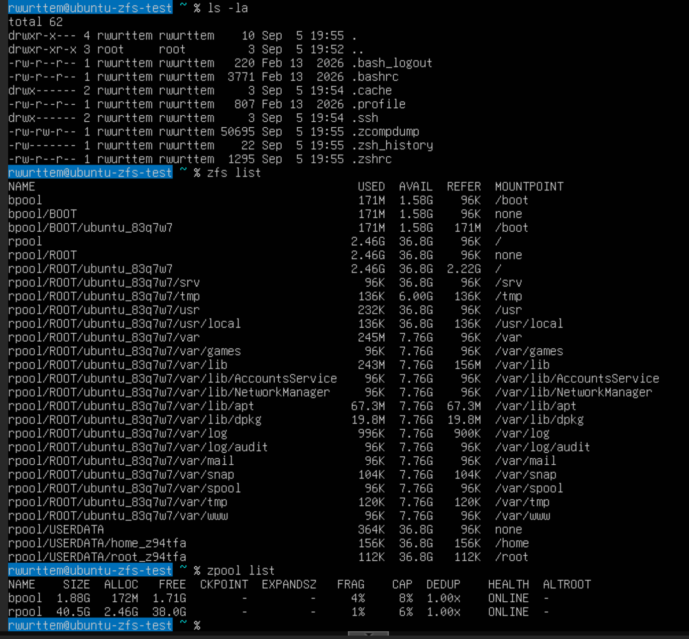

# Ubuntu 26.04 Server: Guided ZFS Root + Extra Datasets via Autoinstall

- **CIS compliant disk layout** — separate mount points for `/var`, `/tmp`,
  `/var/log`, `/var/tmp`, and `/var/log/audit`, matching the CIS Benchmark's
  partitioning recommendations
- **CIS security settings are NOT included** — no `nodev`/`nosuid`/`noexec`
  mount-option hardening, no benchmark packages, no other CIS controls. This
  gives you the disk layout only; hardening is left for you to add separately

This documents an unattended (`autoinstall`) install of Ubuntu Server 26.04.1 with:

- ZFS root, using Subiquity's guided ZFS layout (the only ZFS layout exposed to
  autoinstall today; it is **not** offered in the interactive Server installer UI,
  only via autoinstall or the Desktop installer)
- Two extra datasets the guided layout doesn't create on its own (`var/tmp`,
  `var/log/audit`), plus a `tmp` dataset, added via `late-commands`
- Quotas on `var` (8G) and `tmp` (6G)
- A couple of quality-of-life tweaks (zsh as the login shell, `vim`/`zsh`
  packages, a pinned 2G swap size)

It was built and tested in a Proxmox VM. Nothing here is Proxmox-specific except
the "build the VM" section — the `user-data` file itself works on any hypervisor
or bare metal that boots the Ubuntu Server 26.04.1 ISO.

## Result

`zfs list` / `zpool list` on a freshly installed system, showing the guided
layout plus the `var/tmp`, `var/log/audit`, and `tmp` datasets added by
`late-commands`:



## Why autoinstall instead of the interactive installer

The interactive Server installer (Subiquity's text UI) only offers **LVM** or a
custom manual partition layout — there's no ZFS option in that menu, even though
the Desktop installer has one. Subiquity's own maintainers have confirmed this
directly: ZFS root on Server requires either a Desktop install, autoinstall, or
a fully manual process. Autoinstall is the only one of those that stays
server-oriented and scriptable.

## Requirements

- Ubuntu Server 26.04.1 ISO
- A way to build an ISO with `genisoimage` (or equivalent) and attach it as a
  second virtual CD-ROM alongside the install media
- Basic familiarity with `zfs`/`zpool`

## 1. Build the VM (Proxmox specifics)

- Machine type: `q35`, BIOS: `OVMF` (UEFI), with an EFI disk added
- Leave Secure Boot off for simplicity (untested with Secure Boot + ZFS DKMS)
- Disk: SCSI, VirtIO SCSI single controller, Discard enabled, cache = "No cache"
- At least 4GB RAM (8GB+ more comfortable), 2 vCPUs is plenty for a test box
- 20-32GB disk is comfortable; ZFS datasets share pool space dynamically, so you
  don't need to size `/var`, `/tmp`, etc. individually the way you would with
  fixed partitions
- Attach the Ubuntu Server ISO as one CD-ROM, and the autoinstall seed ISO
  (built below) as a second CD-ROM

None of this is required on other hypervisors — just make sure UEFI boot is
available and you can attach a second CD-ROM/virtual media device.

## 2. The autoinstall files

Two files are needed: `user-data` (the actual autoinstall config) and an empty
`meta-data` (required by the NoCloud datasource format, even with minimal
content).

### meta-data

```yaml
instance-id: ubuntu-zfs-test-01
local-hostname: ubuntu-zfs-test
```

### user-data

```yaml
#cloud-config
autoinstall:
  version: 1
  locale: en_US.UTF-8
  keyboard:
    layout: us

  network:
    network:
      version: 2
      ethernets:
        alleths:
          match:
            name: "en*"
          dhcp4: true

  # Guided ZFS root layout: creates bpool (/boot), rpool/ROOT/ubuntu_<id> (/),
  # rpool/home (/home), and a swap partition. This is the only ZFS layout
  # exposed to autoinstall today; extra datasets are added below.
  storage:
    layout:
      name: zfs
    swap:
      size: 2G

  identity:
    hostname: ubuntu-zfs-test
    username: youruser
    # Generate with: openssl passwd -6
    password: "$6$REPLACE_WITH_YOUR_HASH"

  ssh:
    install-server: true
    allow-pw: true

  packages:
    - vim
    - zsh

  user-data:
    chpasswd:
      expire: false

  late-commands:
    # Set zsh as the login shell -- update the username to match identity.username above
    - curtin in-target -- chsh -s /usr/bin/zsh youruser

    # Ubuntu's guided ZFS layout already creates var and its usual zsys-style
    # children (var/log, var/lib/apt, etc.) automatically. It does NOT create
    # var/tmp, var/log/audit, or tmp -- those we create ourselves. Then apply
    # quotas to var and tmp either way.
    - |
      curtin in-target -- bash -c '
      set -euo pipefail
      ROOTDS=$(zfs list -H -o name -t filesystem | grep -E "^rpool/ROOT/[^/]+$")

      for sub in var/tmp var/log/audit tmp; do
        ds="$ROOTDS/$sub"
        if zfs list -H "$ds" >/dev/null 2>&1; then
          continue
        fi
        path="/$sub"
        stage=/mnt/zfs-stage
        mkdir -p "$stage"
        zfs create -o mountpoint="$stage" "$ds"
        if [ -d "$path" ] && [ -n "$(ls -A "$path" 2>/dev/null)" ]; then
          cp -a "$path"/. "$stage"/
        fi
        rm -rf "${path:?}"/*
        zfs umount "$ds"
        zfs set mountpoint="$path" "$ds"
      done

      zfs set quota=8G "$ROOTDS/var"
      zfs set quota=6G "$ROOTDS/tmp"
      '
```

**Before building the ISO**, edit two things:

1. `identity.username` and the matching username in the `chsh` late-command
2. `identity.password` — generate a real hash with `openssl passwd -6` and
   paste it in (keep the quotes)

## 3. Build the seed ISO

```bash
genisoimage -output seed.iso -volid cidata -joliet -rock user-data meta-data
```

The volume label **must** be `cidata` — that's what the NoCloud datasource
looks for.

## 4. Boot and install

1. Attach both the Ubuntu Server ISO and `seed.iso` to the VM, boot from the
   Server ISO.
2. Recent Subiquity builds auto-detect the `cidata` volume and prompt to
   continue with autoinstall. If it doesn't, hit `e` at the GRUB menu and
   append `autoinstall ds=nocloud;` to the `linux` line.
3. The install runs unattended and reboots when done.

## 5. Verify

```bash
zfs list          # confirm var, var/tmp, var/log, var/log/audit, tmp, home all exist
zfs get quota rpool/ROOT/ubuntu_xxxxx/var rpool/ROOT/ubuntu_xxxxx/tmp
zpool status      # pool health
cat /etc/cron.d/zfsutils-linux   # confirm the built-in monthly scrub/TRIM cron job
```

`zfsutils-linux` (pulled in automatically as a dependency of ZFS root) ships a
cron job that TRIMs on the first Sunday of the month and scrubs on the second
Sunday, for every imported pool, with no extra configuration needed.

## Lessons learned / troubleshooting notes

These are the non-obvious failures hit while building this, in case they save
someone else the same round trips:

- **The Server installer UI has no ZFS option at all**, not even hidden in
  "Custom storage layout" — only Desktop, autoinstall, or a fully manual
  process support ZFS root on Server.
- **Interface names aren't `eth0`** on modern kernels/VirtIO NICs — use a
  `match: name: "en*"` pattern in the network config instead of a hardcoded
  name, or DHCP silently never applies and anything requiring network access
  during install (e.g. a package not in the ISO's offline pool) will fail.
- **Deleting/recreating a virtual disk doesn't guarantee a blank device** on
  LVM-backed storage (including LVM over iSCSI) — LVM by default only zeroes
  the front of a new logical volume, not the whole thing. Leftover ZFS pool
  labels from a previous attempt can survive `wipefs -a` and `sgdisk
  --zap-all` (both only touch the partition table, not partition contents)
  and cause `zpool create` to fail with `is part of potentially active pool`.
  The reliable fix is a full-disk zero: `dd if=/dev/zero of=/dev/sda bs=1M
  status=progress`.
- **`zpool get bootfs rpool` is not a reliable way to find the root dataset.**
  Ubuntu's guided ZFS layout doesn't set the `bootfs` property, so this
  returns `-`. Use `zfs list -H -o name -t filesystem | grep -E
  "^rpool/ROOT/[^/]+$"` instead.
- **Watch your quoting** if you nest a script inside `curtin in-target --
  bash -c '...'` inside a `late-commands` entry — single quotes can't nest
  inside single quotes. Use double quotes for anything inside the outer
  single-quoted block (e.g. a `grep -E` pattern).
- **The guided ZFS layout already creates more separate datasets than you'd
  expect**: `var` and its classic zsys-style children (`var/lib`,
  `var/lib/apt`, `var/lib/dpkg`, `var/log`, `var/mail`, `var/snap`,
  `var/spool`, `var/www`, `var/games`), plus `srv`, `usr/local`, `home`, and
  `root`. It does **not** create `var/tmp`, `var/log/audit`, or `tmp` — those
  need to be added manually if you want them.
- **`zfs set mountpoint=<path> <dataset>` already mounts the dataset** as a
  side effect of the property change. A following explicit `zfs mount
  <dataset>` fails with "already mounted" — harmless in itself, but fatal
  under `set -e`. Don't call `zfs mount` right after `zfs set mountpoint=`.
- If an install fails, the installer drops you to a shell with the message
  "An error occurred. Press enter to start a shell." From there, `curtin`
  itself isn't on `PATH` (it lives inside subiquity's snap) — to poke around
  inside the partially-installed target, bind-mount and chroot manually:
  ```bash
  mount --bind /proc /target/proc
  mount --bind /sys /target/sys
  mount --bind /dev /target/dev
  chroot /target /bin/bash
  ```

## Customizing

- **Different quotas or paths**: edit the `QUOTAS`-equivalent lines and the
  `for sub in ...` list in the late-commands script.
- **Different packages**: edit the `packages:` list.
- **CIS mount-option hardening** (`nodev`/`nosuid`/`noexec`) is intentionally
  *not* included here — this only reproduces the CIS-style dataset/partition
  *layout*, not the security settings. Add ZFS dataset properties like
  `setuid=off`/`exec=off`/`devices=off` per-dataset if you want that too.
